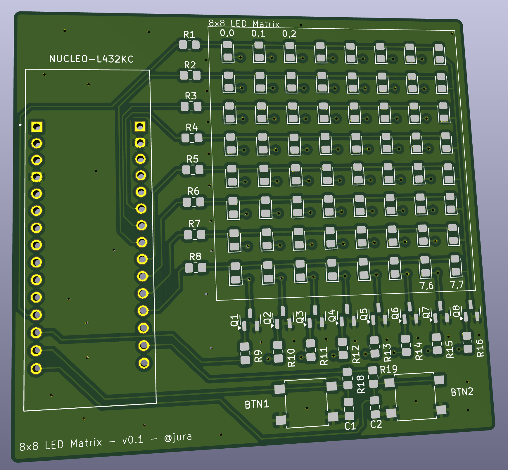

# nucleo32-8x8-led-shield
Simple 8x8 led addon shield for nucleo32 boards. Tested on Nucleo32 L432KC.

Rows are driven through R1-R8, columns get switched by Q1-Q8, and there are two buttons (BTN1/BTN2) on board for input. Plugs straight onto the Nucleo32 headers.
